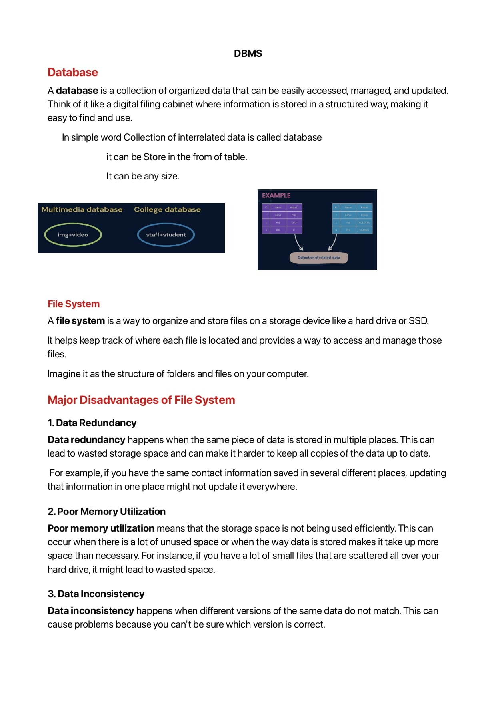
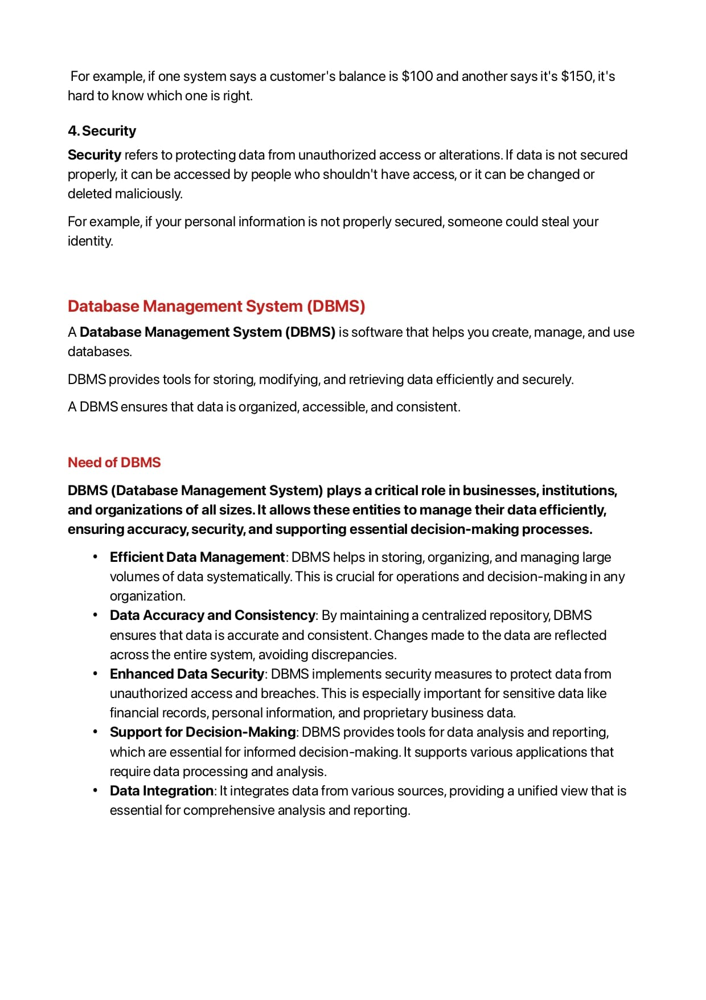
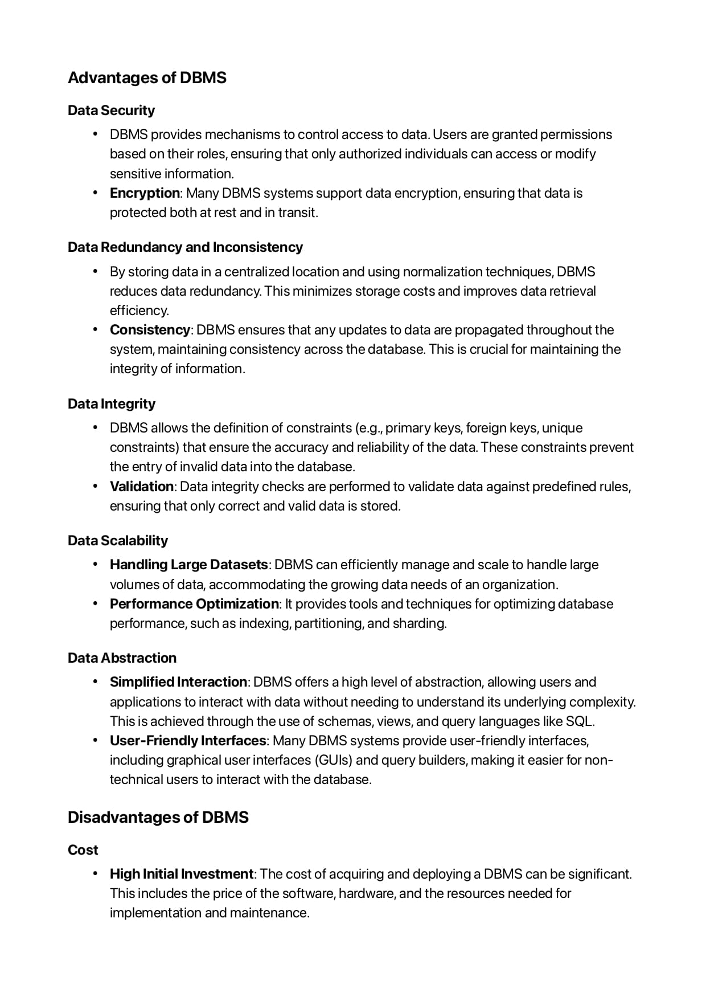
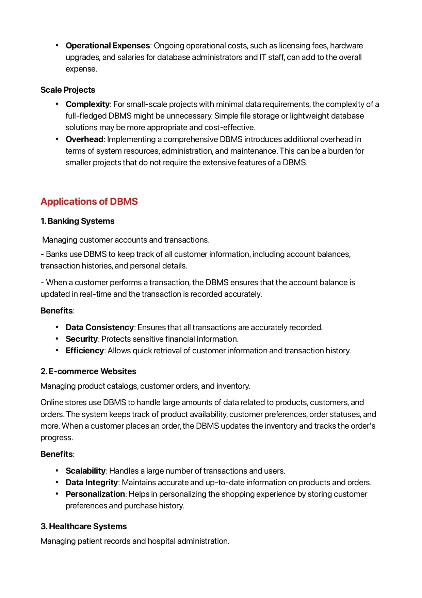
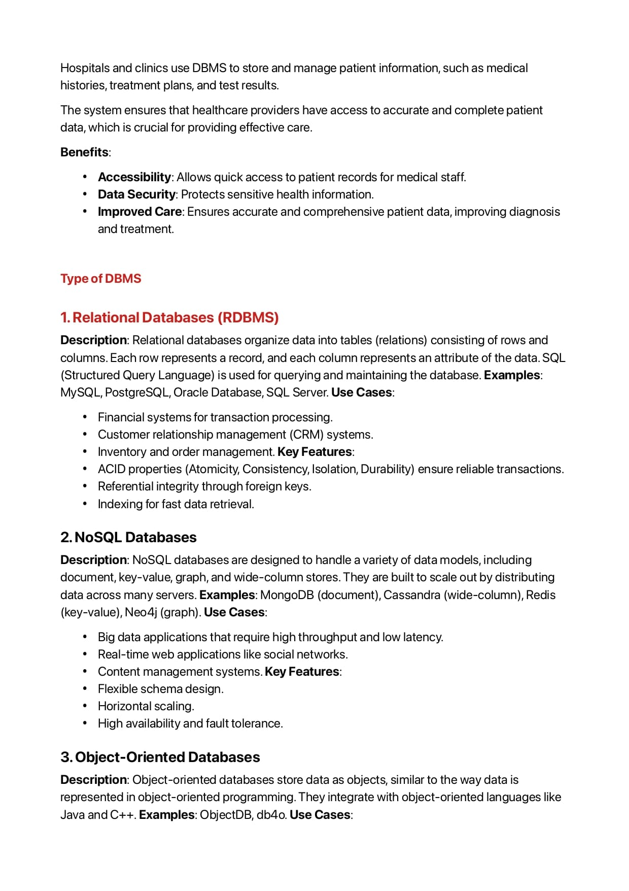
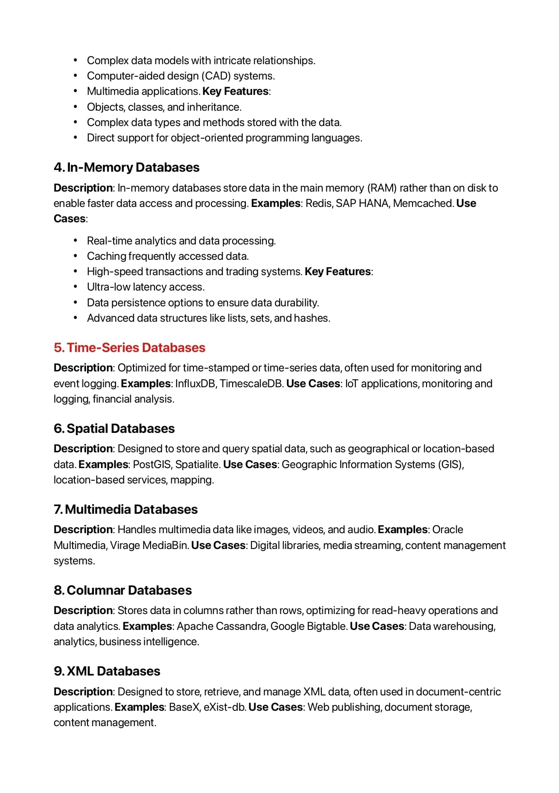

# DBMS Course With Notes

> # DBMS And Its Types

> # Data Abstraction and Types of Level of Data Abstraction.

> #  Schema and Instance , Type of Schema , and Its Characterstic.

### `Physical Schema :-  We Focous on where the data is stored.   `

### `Logical Schema :- In Logical Schema We Focous What data is Stored in DB.   `

> #  DBMS Architecture and Its Types.

> #  DBMS Architecture Tier 3 Layers And Adv And Dis.

> #  Data Models and Types of Model.

> #  Data Models and Types of Model.

> #  Data Models and Types of Model.

